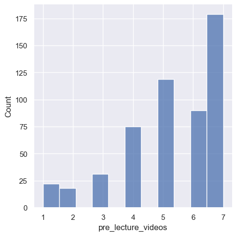
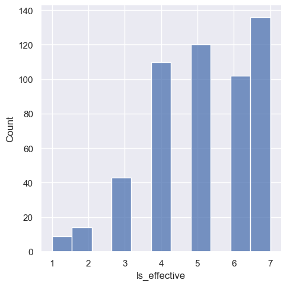
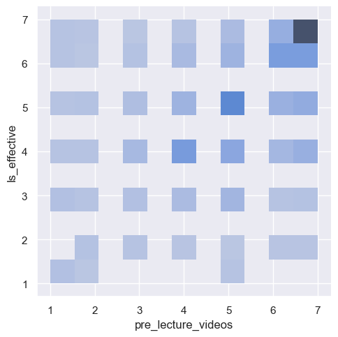

---
# Do not edit the text between these lines!
layout: default
---
<body style = "background-color: #98e4f6;"></body>
## Summary of Analysis

In the Jupyter Notebook, data was used from survey_izzi.csv which contained 534 responses and 44 variables. Using the head function we were able to create a table of all the columns with responses. We then selected two variables to focus on: pre_lecture_videos and ls_effective. Both columns held string responses so we used the function convert_columns_to_ints to convert the rating into integers. We then counted the frequency of ratings. In pre_lecture_videos a rating of 7 (strongly agree pre_lec videos prepare students)  was most common with 179 responses and for ls_effective 7 (strongly agree lesson videos are effective to learn course material) was also the most common. 3 visualizations were produced. Figure 1.1 is a histogram of the ratings of pre_lecture_videos and its count. Figure 1.2 is a histogram of ls_effective, and Figure 1.3 is a histogram both of them combined. All visualization further confirmed the usefulness of videos. 

<!-- This is a comment. Below, you'll see code for inserting an image. To make this image appear, update <custom-path>. To add an image, save it inside the imgs folder of this repository. -->

Figure 1.1: Histogram of pre_lecutre_videos variable

  Figure 1.2: Histogram of ls_effective variable

  Figure 1.3: Histogram of both pre_lecture_videos and ls_effective variables

## Conclusion 

The data supports the recommendation of pre-tutorial videos being handed out to students. The distribution of the pre_lecture_videos ratings is skewed towards the right or towards the higher agreement of their effectiveness. The highest rating among students is a 7, which means they feel like it would benefit them greatly. Similarly, in the distribution of effectiveness of lesson videos, it was skewed right meaning students thought it would be beneficial to implement as well. When compared together, the darkest cell in Figure 3 is at the (7,7) intersection. Additionally, refinements such as video length, access, and time of releasing could all have an effect on effectiveness and should be explored further. Finally, potential trade-offs could be that it would be more time-consuming for instructors to produce these videos. Students who do not look at the videos would not benefit and therefore, the effort put into making them would be wasted. 

